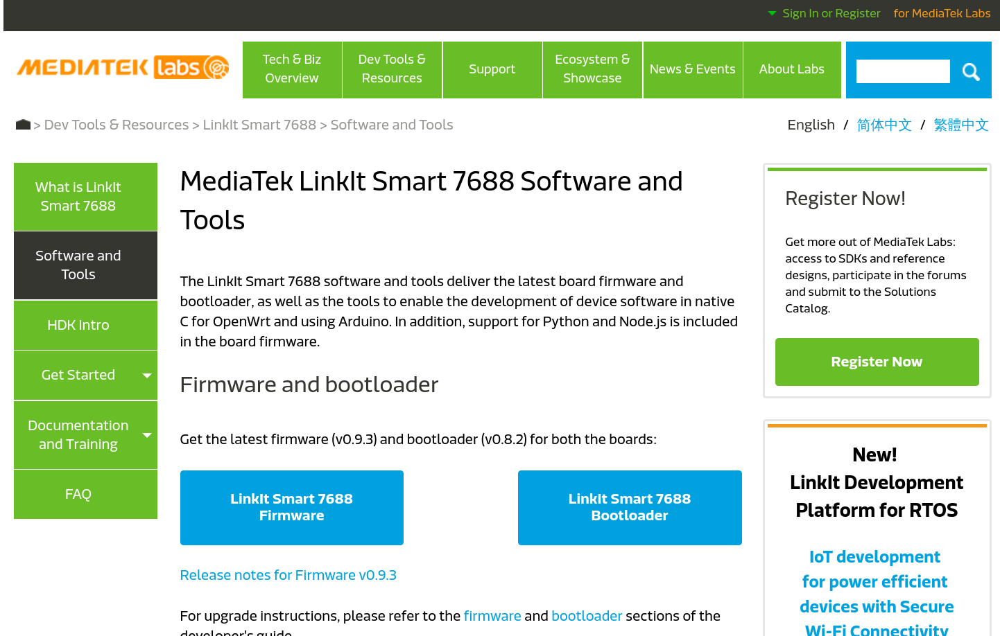
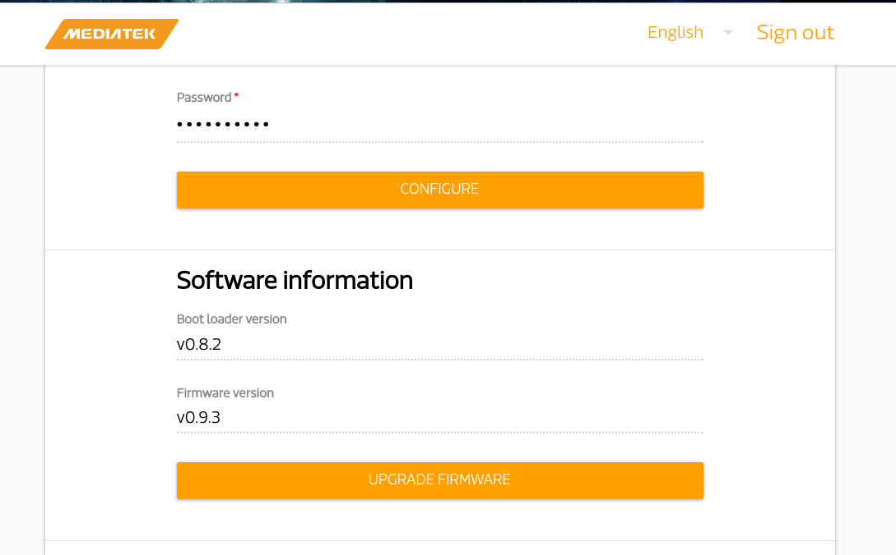

# Burn Firmware

## Factory reset 7688

1. Power on the 7688 and wait a moment to ensure the bootup process is finished.
2. Press the WiFi button for 20 seconds.
3. Release the button and you will see the orange light, 
	which means it starts to reset.
4. After a few minutes, you can see the WiFi SSID 
	LinkIt_Smart_7688_xxx broadcasted by your 7688. 

For example:

## Firmware and bootloader

Download the latest firmware from official website.
https://labs.mediatek.com/site/global/developer_tools/mediatek_linkit_smart_7688/sdt_intro/index.gsp

There are two ways to update bootloader.

One is via Web UI.

Another way is via usb drive.
Here is nice tutorial video.

https://www.youtube.com/watch?v=YZ1Zkg7vBqQ 

