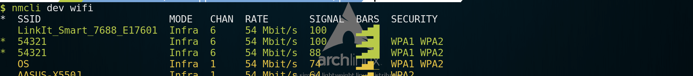
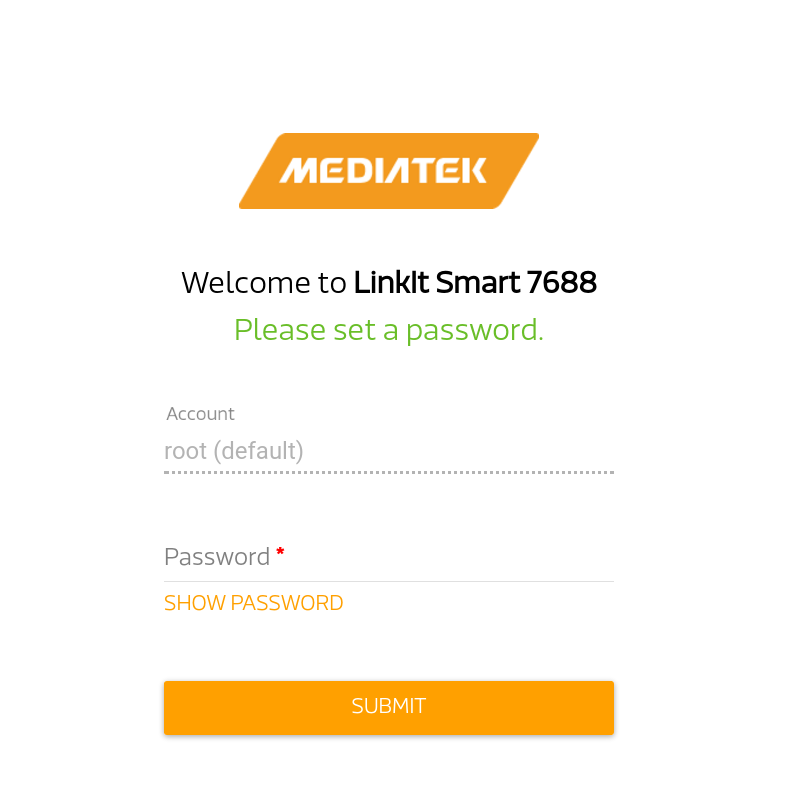
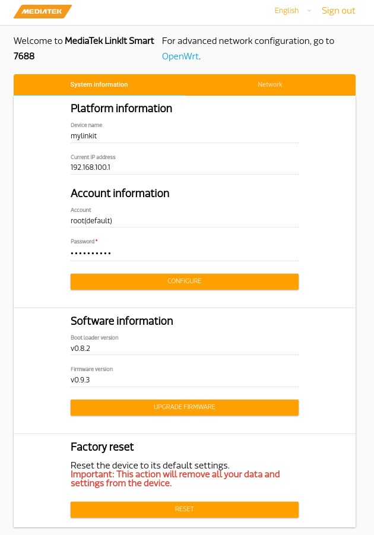
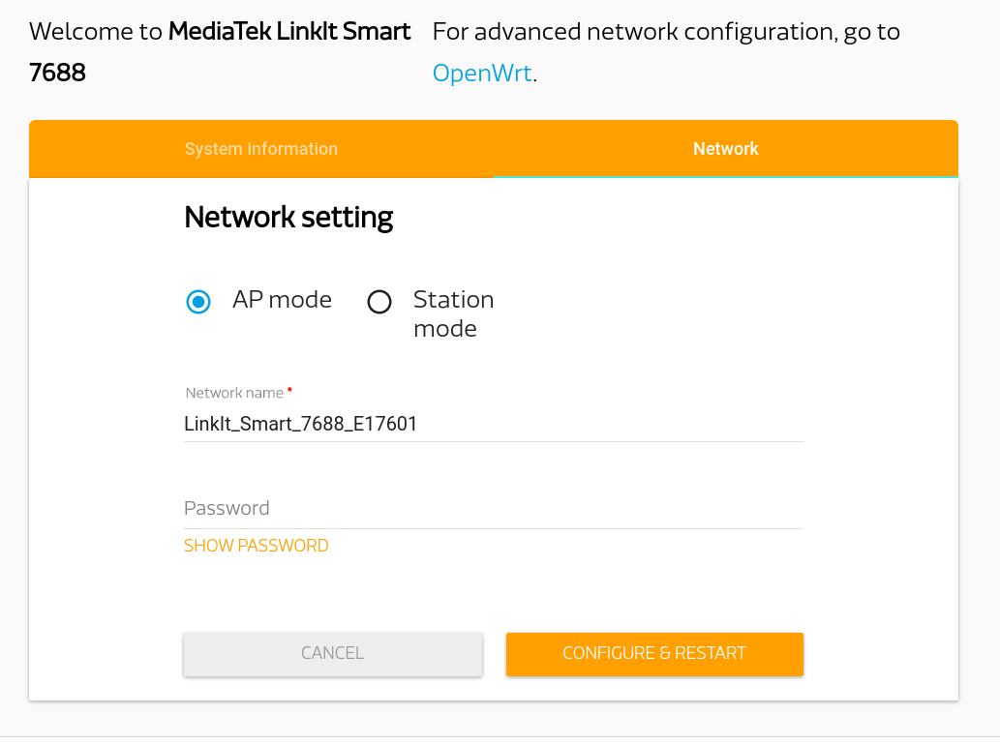
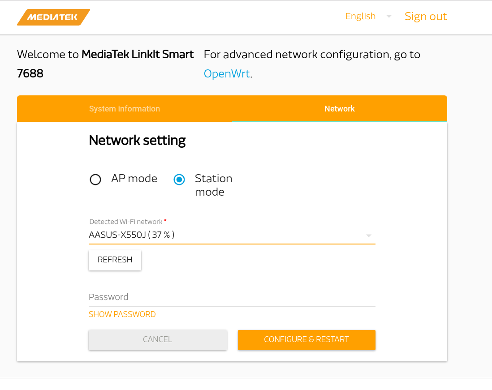

# First Use

The LinkIt 7688 works in AP mode in default after power on.
You can scan the SSID __Linkit_Smart_7688_XXX__ by computer.


Connect to this WiFi and open 192.168.100.1 with the browser.



You will need to set a new password for log in  7688.

After login, you will see a Web UI to configure your 7688.




# Configure network setting with Web UI

Click Network button on the upper right corner.


The default mode is AP mode without password, 
you can fill in the blank to set a wifi password.

And if you have a local wifi, 
you can switch to station mode and type in the SSID and password.


# Log in 7688

We use SSH to log in since it's the simplest way and wirelss.
If you prefer log in 7688 with a cable, 
you may refer to the [advanced setup instruction](advanced-setup.md)

For Windows users, it's recommended to use PuTTY.
http://www.chiark.greenend.org.uk/~sgtatham/putty/download.html

For Mac OS X / Linux users, just launch terminal and type following command.
Replace the IP_OF_7688 with the ip of your 7688.
```sh
ssh root@IP_OF_7688
```
If the 7688 is in station mode and your computer has connect to it, 
then the default ip is 192.168.100.1

