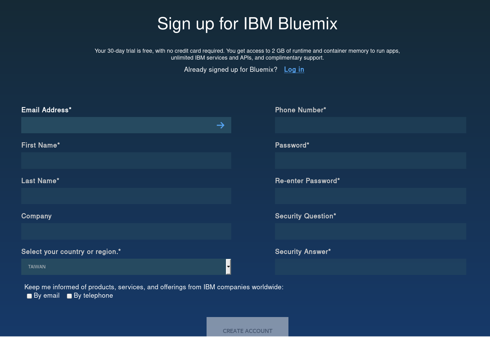

# IBM Bluemix Setup


## Create a IBM Bluemix account

Sign up a new account.

https://new-console.ng.bluemix.net/docs/overview/index.html


Fill in the all blocks and click create account.


Check your email and confirm it.


After log in, you need to create a organization and space first.

Note that you need choose the region to US South.


Then you log in to the console successfully.


## Install Cloud Foundary

Just download the required package and follow the steps to install it.

Official setup supports windows, mac os x, linux(Debian/Ubuntu, Red Hat), 
both 32/64 bit architecture are supported.

https://docs.cloudfoundry.org/cf-cli/install-go-cli.html


For Arch linux users, you may install it directly from AUR.
```sh
yaourt -S cloudfoundry-cli
```

Now you can launch a terminal, and login the Bluemix API with cf cli. 

(Command Prompt in Windows, or you can use PowerShell if you have it.)

```sh
cf login -a https://api.ng.bluemix.net
```

Type in your email and password of the Bluemix account, 
and it will automatically target to org and space, 
which have been set in Web UI.

```sh
API endpoint: https://api.ng.bluemix.net

Email> 
Password> 
Authenticating...
OK

Targeted org az6980522+0910

Targeted space dev


API endpoint:   https://api.ng.bluemix.net (API version: 2.54.0)
User:           az6980522+0910@gmail.com
Org:            az6980522+0910
Space:          dev
```


## Install Node.js and NPM (nodejs package manager)

https://nodejs.org/en/download/


For Windows/Mac OS X, 
it is convinent to use the installer at the official website.
Note that the npm has been included in the nodejs installer.

For linux, 
it is recommended to install nodejs and npm with your package manager.

Debian/Ubuntu
```sh
sudo apt-get install node npm
```
Arch
```sh
yaourt -S node npm
```


## Reference

* Node.js SDK of Watson-developer-cloud
	https://github.com/watson-developer-cloud/node-sdk


