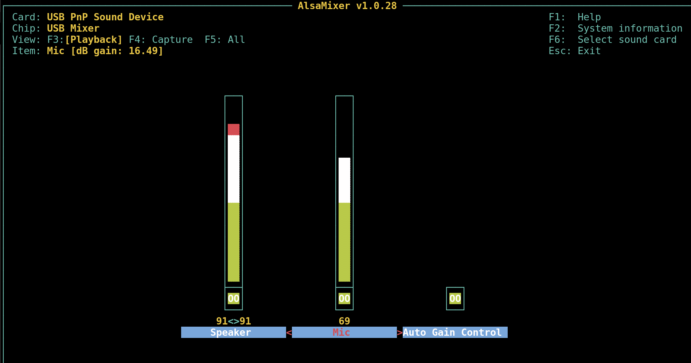
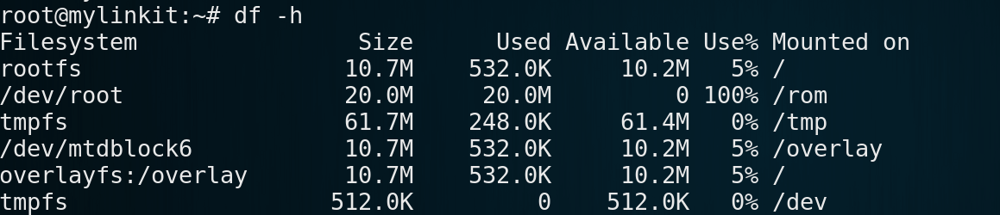
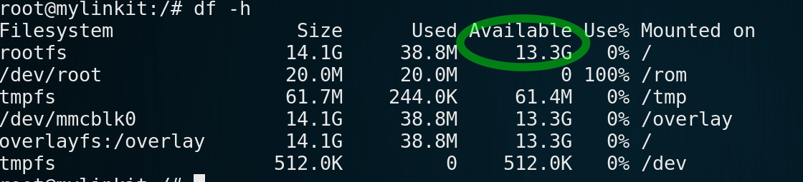
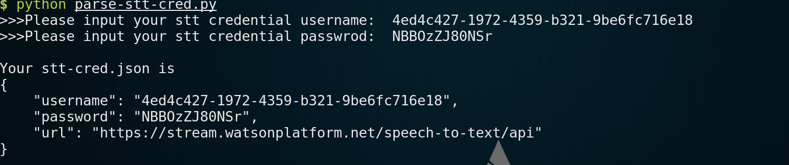

# Dialog Robot

## Demo

https://www.youtube.com/watch?v=Smp5kGfYSCE 

## Prerequisites

1. USB sound card, such as https://www.amazon.com/External-Adapter-Desktop-Notebook-Laptop/dp/B001MW92AE

2. USB OTG cable
3. Speaker 
4. Microphone
5. Micro SD card


## Let's get started 


### Congigure the USB sound card.

First log in to 7688 and type following commands in tty.

Install usb audio driver.

```sh
opkg update
opkg install kmod-usb-audio
```

Now plug in your usb sound card to 7688 with a usb OTG cable.

Launch alsamixer to tune the gain of the usb sound card.

```sh
alsamixer
```
Remember to press F6 to select USB sound card 





### Extend root file system to SD card.

Since the original space on 7688 is too small to complete this project, 
we need to extend the system to external device.

List orginal space on-board flash.

```sh
df -h
```



Install the required packages.

```sh
opkg update
opkg install block-mount kmod-fs-ext4 kmod-usb-storage-extras e2fsprogs fdisk
```

Insert the SD card and format it to ext4 file system.

Note that if mmcblk0 is not found, reboot may fix it.

```sh
reboot
```

And if the system alerts that /dev/mmcblk0 is mounted, you should unmount it first.

```sh
umount /dev/mmcblk0
```

Format the sd card, press y to to confirm the process to remove all data on it.

Please be patient since the process may take a few minutes if your sd card has large space.

```sh
mkfs.ext4 /dev/mmcblk0
```

Duplicate the root file system to SD card.

```sh
mount /dev/mmcblk0 /mnt
tar -C /overlay -cvf - . | tar -C /mnt -xf -
umount /mnt
```

Congiure the fstab.

Generate file system table, and then change the target option to '/overlay', 
and the enabled option to '1'.

```sh
block detect | 
sed $'s/enabled[[:blank:]]\'0\'/enabled \'1\'/g' |
sed 's%/mnt/mmcblk0%/overlay%g' > /etc/config/fstab
```


Reboot and check the new space.

```sh
reboot
df -h
```




### Speech to text service on Bluemix

Follow this [instruction](bluemix-setup.md) to finish the configuration of cf.

Then launch a terminal (Command prompt in Windows) and type the following commands.


```sh
cf create-service speech_to_text standard my-stt-service
cf create-service-key my-stt-service stt-cred
cf service-key my-stt-service stt-cred
```

Then you will get your credential of speech to text service.

For example:
```sh
Getting key stt-cred for service instance my-stt-service as az6980522+0910@gmail.com...

{
 "password": "NBBOzZJ80NSr",
 "url": "https://stream.watsonplatform.net/speech-to-text/api",
 "username": "4ed4c427-1972-4359-b321-9be6fc716e18"
}
```
Please remember the above username and password, 
or you can copy the content and save as a text file.


### Deploy the app on 7688

Now please log in 7688 and deploy the application on it.

First, download the dialog robot code to 7688 and unzip it.

```sh
curl -L https://github.com/YuanYouYuan/7688-note/raw/master/ch2-application-with-bluemix/code/7688-dialog-robot.tar.gz | tar zxv
```

Change the directory to 7688-dialog-robot and input your stt service credential.

```sh
python parse-stt-cred.py
```




Final step. 

Plug in USB sound card on 7688 USB port, and connect microphone and speaker.

Type in the following command to exectue node app.

```sh
node app.js
```

Enjoy it!!!

