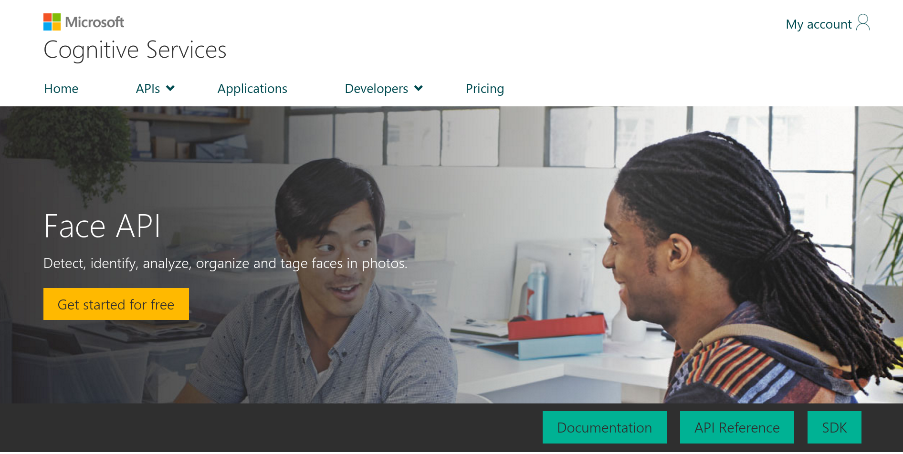
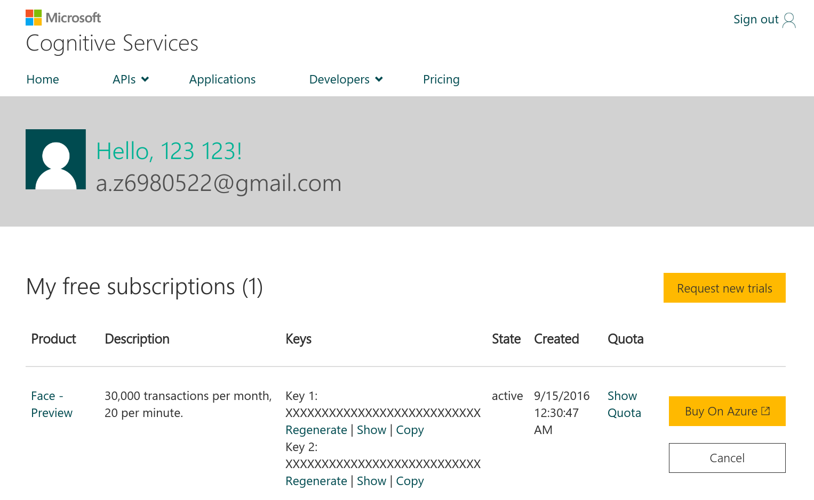

# Application With Microsoft Cognitive Service

This project is for connecting web cam and Microsoft cognitive service through Linkit 7688,meanwhile, display the detected face information on the webpage 

#Requirements
*  Linkit smart 7688 Duo
*  webcam


#Code review

###cognitive.js
* open the webcam
* make snapshot periodically and output a jpg file
* read the jpg file and post to cognitive api
* recieve the response 
* use socket.io to send data to index.html
* html canvas draw the text and frame


# Usage

Login 7688 and type the following commands in the console.

Download the code and change the working directory to it.

```sh
curl -L https://github.com/YuanYouYuan/7688-note/raw/master/ch3-ms/code/face-cognition/ms-face-cognition.tar.gz | tar zxv
cd ms-face-cognition
```

Then use sed command to change the __linkit_7688_ip__ to which ip your 7688 is using.
For example, my pc and 7688 are in the same local network, and my 7688 ip is 192.168.0.102.

```sh
sed -i 's/linkit_7688_ip/192.168.0.102/g' cognitive.js static/index.html
```
Go to Microsoft Cognitive Service website and regist a new account if you don't have one.
https://www.microsoft.com/cognitive-services


And go to Face API and have your new face api key.





Press _copy_ button in Keys column and paste it in the sed command.
For examle, my api key is a05f5738bdd7449b85ced1075129137b.

```sh
sed -i 's/my-face-cognition-api-key/a05f5738bdd7449b85ced1075129137b/g' face-cognition.js
```

Finally, connect your webcam with OTG cable to 7688 and run the cognition.js!

```sh
node face-cognition.js
```


